# SdC_TP1

## Tutorial de gprof

**1. Creación de los archivos y ejecución del código**

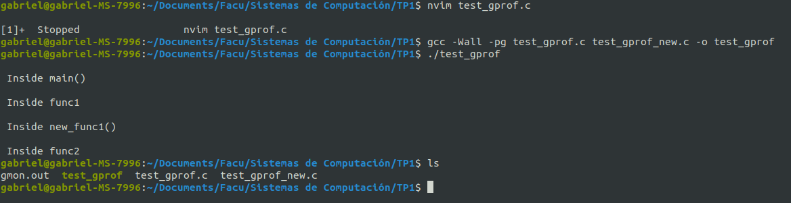

**2. Ejecución de gprof**

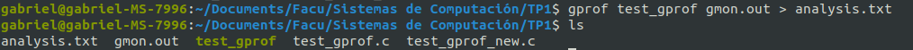

**3. Archivo analysis.txt**

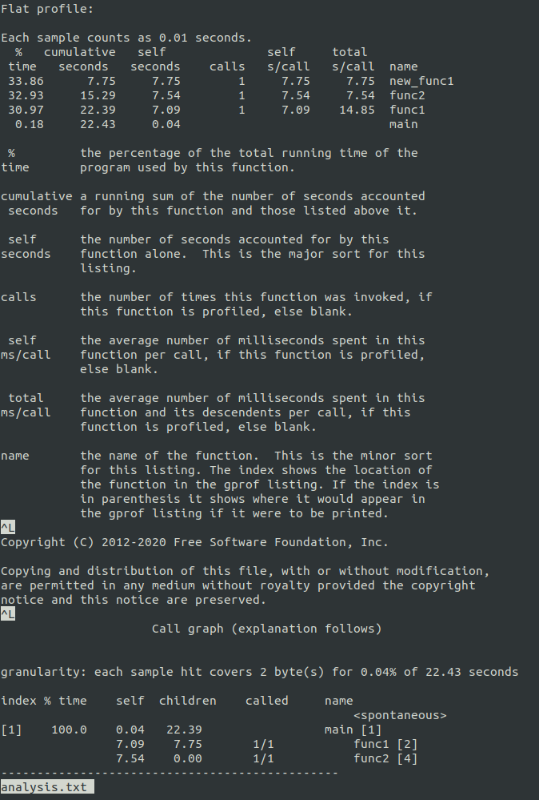

**4. Customizando la salida usando flags**

**1. Supresión de funciones declaradas estáticamente usando -a**

   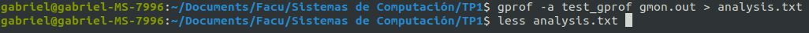
   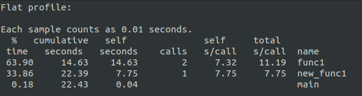

**2. Eliminación de textos detallados usando -b**

   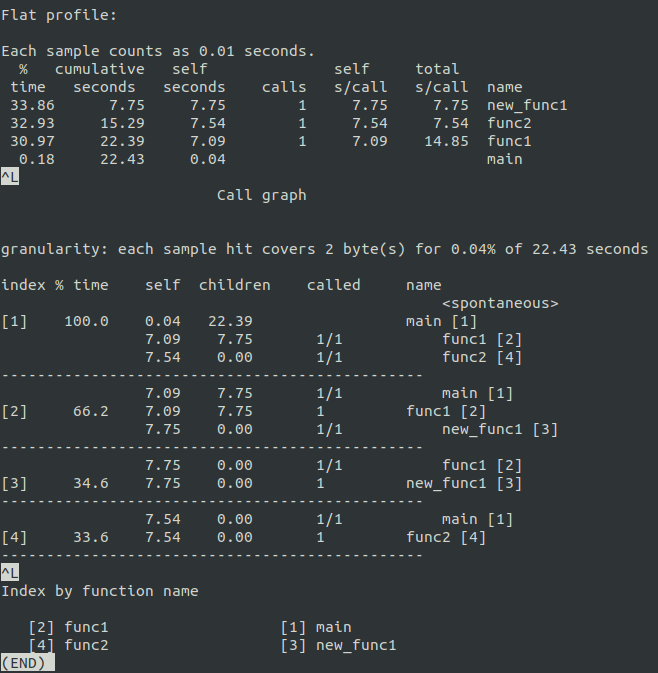

**3. Impresión de sólo el perfil plano**

   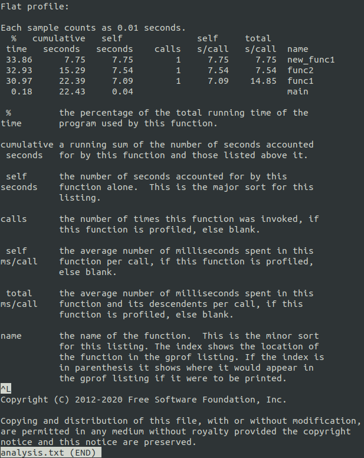

**4. Impresión de información relacionada con funciones específicas en perfil plano**

   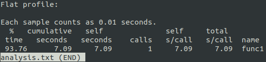

**5. Gráfico de los resultados**

Creamos una visualización de la salida de gprof usando gprof2dot.

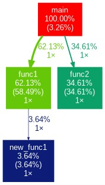

**6. Uso de perf**

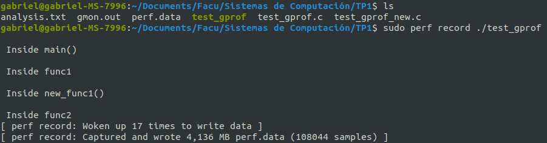

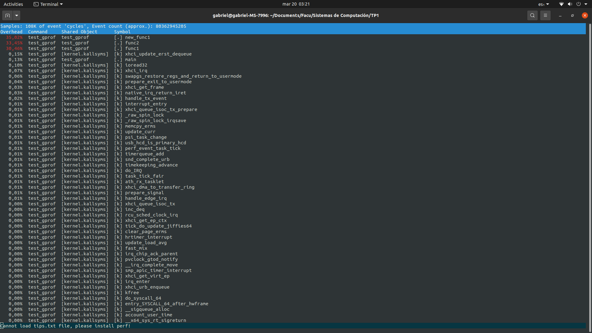

## Benchmarks

En el ámbito de la computación, el término *benchmark* hace referencia a un conjunto de pruebas o procedimientos diseñados para evaluar cuantitativamente el rendimiento de un sistema informático en un entorno controlado. La finalidad principal de estas mediciones es ofrecer métricas objetivas que posibiliten la comparación equitativa de diferentes configuraciones de hardware o software. De este modo, los benchmarks constituyen una herramienta esencial para identificar cuellos de botella, determinar la eficacia de posibles optimizaciones y guiar la toma de decisiones al momento de seleccionar componentes o ajustar parámetros del sistema (Smith et al., 2020). 

Existen numerosos tipos de benchmarks, cada uno enfocado en áreas específicas de desempeño. Algunas herramientas simulan cargas de trabajo muy cercanas a la realidad, mientras que otras se especializan en estresar un único subsistema (por ejemplo, CPU, GPU, memoria o disco). La elección de un benchmark adecuado debe responder al tipo de aplicación o tarea que se desee representar. No es lo mismo evaluar la rapidez en la compilación de un kernel de Linux que medir la capacidad de la CPU para procesar gráficos 3D o ejecutar cálculos numéricos de alta precisión.  

### Principales Benchmarks Utilizados en la Práctica  

#### 1. Phoronix Test Suite (PTS)  

- Ofrece una gran variedad de pruebas, con un enfoque sobresaliente en entornos Linux.  
- Permite automatizar la evaluación de rendimiento en tareas reales, como la compilación del kernel de Linux (build-linux-kernel), lo que aporta un indicador confiable del desempeño en desarrollos y proyectos de software de gran escala.

#### 2. Geekbench  

- Evalúa la CPU en múltiples dimensiones (cálculo, cifrado, compresión, etc.) simulando escenarios de uso cotidiano.  
- Entrega resultados tanto en single-core como en multi-core, facilitando la comparación de procesadores que hacen un uso intensivo del paralelismo.

#### 3. Cinebench  

- Se centra en la medición del rendimiento durante el renderizado 3D y el procesamiento de escenas complejas.  
- Suele ser un referente para quienes requieren altos niveles de throughput en aplicaciones de diseño o edición multimedia.  

#### 4. PassMark  

- Reúne pruebas que abarcan CPU, gráficos en 2D/3D, memoria y almacenamiento, generando una puntuación global.  
- Brinda una vista panorámica de las capacidades del sistema, resultando útil para comparar múltiples equipos con un criterio unificado.  

#### 4. Stress-ng

- Diseñado para “estresar” el hardware, más que para generar una puntuación de referencia.  
- Utilizado sobre todo para evaluar la estabilidad del sistema y detectar posibles problemas de sobrecalentamiento o throttling en situaciones de carga extrema.

#### 4. HPC Challenge / Linpack  

- Orientados a la computación de alto rendimiento (HPC).
- Miden operaciones matemáticas intensivas (como FLOPS) y la eficiencia en cargas científicas, siendo indispensables en simulaciones y entornos de supercómputo.

| Actividad | Benchmark representativo |
| :---:     | :---:                    |
| Navegación web, multitarea en entornos virtuales     | Geekbench (simula escenarios reales) |
| Programación y compilación de proyectos pesados | Phoronix -- test "build-linux-kernel" |
| Gaming | 3DMark |

## Rendimiento

A continuación, se muestra el cálculo del rendimiento de cada procesador —expresado como el inverso del tiempo de compilación del kernel de Linux—, así como la comparación relativa entre ambos.

### Datos de referencia

- **Intel Core i5:** 83 segundos.
- **AMD Ryzen 9 9500X:** 97 segundos.

## Cálculo de Rendimiento Absoluto

El rendimiento se determina mediante la siguiente fórmula:  

$$ Rendimiento = {1 \over Tiempo de compilación}$$  

En consecuencia, para cada procesador se obtiene:

**1. Intel Core i5**

$$ Rendimiento_{i5} = {1 \over 83} \approx 0.0120 $$  

**2. AMD Ryzen 9 5900x**

$$ Rendimiento = {1 \over Tiempo de compilación} \approx 0.0103 $$  

## Comparación del Rendimiento Relativo

Para conocer qué el RR asociado a estos dos procesadores se puede realizar el siguiente cociente:

$$ { Rendimiento_{i5} \over Rendimiento_{Ryzen} } = { 0.0120 /over 0.0103 } \approx 1,17 $$

Este cociente indica que el ** Intel Core i5 obtiene un desempeño aproximadamente un 17% superior ** al del AMD Ryzen 9 5900X en la tarea de compilación del kernel de Linux, según los tiempos de 83 s y 97 s respectivamente.

## Cálculo del Speedup

Para cuantificar el incremento de rendimiento que aporta el Ryzen 9 7950X respecto a los otros modelos, se comparan directamente los valores obtenidos:

**1. 7950X vs. Intel Core i5**

$$ { Rendimiento_{7950X} \over Rendimiento_{i5} } = { 0.0189 /over 0.0120 } \approx 1,58 $$

En términos porcentuales, esto equivale a decir que el ** Ryzen 9 7950X ** ofrece un rendimiento ** un 58% superior ** frente al Intel Core i5 para la tarea de compilación del kernel (53 s vs. 83 s).

**2. 7950X vs. Ryzen 9 5900X**

$$ { Rendimiento_{7950X} \over Rendimiento_{6900X} } = { 0.0189 /over 0.0103 } \approx 1,84 $$

Aquí, el ** Ryzen 9 7950X **  muestra un rendimiento ** un 84% mayor **  que el Ryzen 9 5900X (53 s vs. 97 s).

## Variación del tiempo del programa de acuerdo a la frecuencia en una ESP32

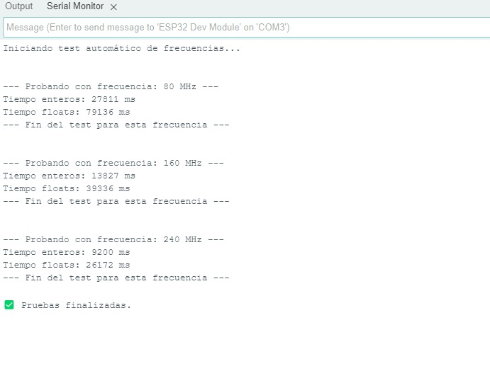

El código implementado realiza operaciones aritméticas simples sobre grandes cantidades de datos, utilizando tanto enteros como números flotantes. Este procesamiento fue ejecutado en una placa ESP32 bajo distintas frecuencias de reloj: **80 MHz**, **160 MHz** y **240 MHz**. En cada caso se midió el tiempo de ejecución utilizando `millis()` para cada tipo de operación.

Los resultados muestran que el **tiempo de ejecución disminuye claramente al aumentar la frecuencia del procesador**,  de manera **directamente proporcional a la velocidad de la CPU**. Por ejemplo, al duplicar la frecuencia de 80 MHz a 160 MHz, los tiempos para las sumas de enteros y floats se reducen aproximadamente a la mitad, y al triplicar la frecuencia (a 240 MHz), los tiempos vuelven a caer en proporción.

Además, se observa que las **operaciones con números flotantes tardan considerablemente más** que las de enteros, debido al mayor costo computacional que implica la aritmética en punto flotante.

