# Trabajo Práctico N°4: Módulos de Kernel

**Materia:** Sistemas de Computación
**Integrantes:**
*   Bustos Hugo Gabriel
*   Rodriguez Facundo
*   Vasquez Francisco Javier


**Grupo:** Grupo1  
**Fecha de Entrega:** 26/05/2025  
**Profesores:** Miguel Ángel Solinas, Javier Alejandro Jorge  

## Introducción

El presente trabajo práctico tiene como objetivo introducirnos en el mundo de los módulos de kernel en sistemas Linux. Exploraremos qué son, cómo se compilan, cargan, descargan y cómo interactúan con el sistema operativo. Además, se abordarán aspectos de seguridad relevantes como la firma de módulos para entornos con Secure Boot habilitado y el uso de herramientas como `checkinstall` para el empaquetado de software y `strace` para el análisis de llamadas al sistema.

Los módulos de kernel son fragmentos de código que pueden ser cargados y descargados dinámicamente en el kernel según se requiera, extendiendo su funcionalidad sin necesidad de reiniciar el sistema. Esta capacidad es fundamental para la flexibilidad y mantenibilidad de los sistemas Linux modernos, permitiendo, por ejemplo, la adición de controladores de dispositivo para nuevo hardware.

## Preparación

 Se utilizó el repositorio base proporcionado por la cátedra y se procedió a la instalación de las herramientas necesarias:

```bash
sudo apt-get update
sudo apt-get install build-essential checkinstall kernel-package linux-source git
```

Se clonó el repositorio de la cátedra y se creó una copia para el trabajo del grupo:
*   Fork del profesor: `https://gitlab.com/sistemas-de-computacion-unc/kenel-modules.git`

## Desafío #1

### ¿Qué es `checkinstall` y para qué sirve?

`checkinstall` es una herramienta que permite construir un paquete binario (como `.deb` para sistemas Debian/Ubuntu, `.rpm` para sistemas Red Hat/Fedora, o paquetes Slackware) a partir de código fuente compilado. Su principal utilidad radica en que, en lugar de ejecutar `make install` directamente (lo que esparce archivos por el sistema sin un control centralizado), `checkinstall` monitorea los archivos instalados por `make install` y los empaqueta.

Esto ofrece varias ventajas:
1.  **Desinstalación Limpia:** El paquete creado puede ser desinstalado fácilmente usando el gestor de paquetes del sistema (ej. `dpkg -r nombre_paquete` o `apt-get remove nombre_paquete`), eliminando todos los archivos que instaló y evitando dejar basura en el sistema.
2.  **Gestión de Paquetes:** Permite tratar el software compilado desde las fuentes como un paquete más del sistema, facilitando su seguimiento, actualización (si se reconstruye el paquete) y distribución a otras máquinas similares.
3.  **Información del Paquete:** Permite agregar metadatos al paquete, como descripción, versión, dependencias, etc.

En resumen, `checkinstall` ayuda a mantener el sistema más limpio y organizado al instalar software desde fuentes, integrándolo con el sistema de gestión de paquetes nativo.

### Empaquetando un "Hello World" con `checkinstall`

Se creó un programa simple "Hello World" en C y se empaquetó utilizando `checkinstall`.

**Código Fuente (`practico/checkinstall_ejemplo/hello_checkinstall.c`):**
```c
#include <stdio.h>

int main() {
    printf("Hello World desde el programa empaquetado con checkinstall del Grupo1!\n");
    return 0;
}
```

**Makefile (`practico/checkinstall_ejemplo/Makefile`):**
```makefile
CC=gcc
CFLAGS=-Wall
TARGET=hello_checkinstall
PREFIX?=/usr/local

all: $(TARGET)

$(TARGET): hello_checkinstall.c
	$(CC) $(CFLAGS) -o $(TARGET) hello_checkinstall.c

install: $(TARGET)
	mkdir -p $(DESTDIR)$(PREFIX)/bin
	cp $(TARGET) $(DESTDIR)$(PREFIX)/bin/

uninstall:
	rm -f $(DESTDIR)$(PREFIX)/bin/$(TARGET)

clean:
	rm -f $(TARGET)
```

**Proceso de empaquetado:**
Dentro del directorio `practico/checkinstall_ejemplo/`:
1.  Compilación: `make`
2.  Empaquetado con `checkinstall`: `sudo checkinstall`
    *   Durante este proceso, se aceptaron las opciones por defecto y se proporcionó una breve descripción para el paquete.

**Evidencia:**
*   El paquete `.deb` generado se encuentra en `practico/checkinstall_ejemplo/checkinstall-ejemplo_20250523-1_amd64.deb` (el nombre exacto puede variar ligeramente con la fecha y versión).
*   Capturas de pantalla:
    *   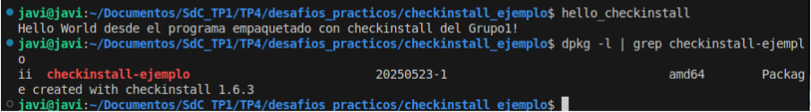
    *   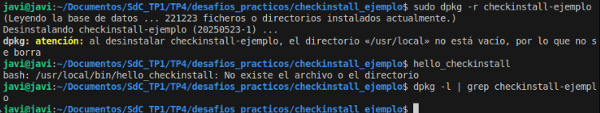

### Mejorando la Seguridad del Kernel: Firma de Módulos y Rootkits

La seguridad del kernel es primordial, ya que un kernel comprometido implica un sistema completamente comprometido. Una de las vías de ataque es la carga de módulos de kernel maliciosos (rootkits de kernel).

**Rootkits de Kernel:**
Un rootkit es un tipo de software malicioso diseñado para obtener acceso no autorizado o de alto nivel (root) a un sistema informático sin ser detectado. Los rootkits de kernel operan en el nivel más privilegiado del sistema operativo, modificando el propio kernel o cargando módulos maliciosos para ocultar su presencia, interceptar datos, crear puertas traseras, etc. Al ejecutarse en el espacio del kernel, tienen control total sobre el sistema.

**Firma de Módulos:**
La firma de módulos de kernel es un mecanismo de seguridad que busca asegurar que solo los módulos de confianza puedan ser cargados en el kernel. El proceso implica:
1.  **Generación de un par de claves:** Una clave privada (secreta) y una clave pública (distribuible).
2.  **Firma del módulo:** El módulo compilado (`.ko`) se firma digitalmente utilizando la clave privada. Esta firma se adjunta al módulo.
3.  **Verificación por el kernel:** Cuando se intenta cargar un módulo, si el kernel está configurado para ello (especialmente con Secure Boot activo), verifica la firma del módulo utilizando claves públicas de confianza.
    *   Estas claves públicas de confianza pueden estar embebidas en el kernel, o cargadas a través de mecanismos como el Machine Owner Key (MOK) list, gestionado por Shim en el proceso de arranque de Secure Boot.

**¿Cómo ayuda la firma de módulos contra los rootkits?**
Si el sistema está configurado para requerir módulos firmados por claves de confianza (por ejemplo, con Secure Boot activo y `CONFIG_MODULE_SIG_FORCE` habilitado en el kernel):
*   Un atacante que intente cargar un módulo de rootkit no firmado o firmado con una clave desconocida no podrá hacerlo, ya que la verificación de la firma fallará.
*   Esto dificulta significativamente la persistencia de rootkits que dependen de la carga de módulos.

**Secure Boot** juega un papel crucial aquí, ya que asegura la integridad de la cadena de arranque desde el firmware hasta el kernel y, potencialmente, hasta los módulos cargados. Si Secure Boot está activo, el kernel suele ser más estricto con la validación de las firmas de los módulos.

La bibliografía proporcionada, como la documentación de Red Hat sobre "Signing Kernel Modules for Secure Boot", detalla estos procesos y su importancia.

---

## Desarrollo Práctico y Respuestas

### Parte 1: Módulo del Profesor (Base)

Se trabajó inicialmente con el módulo `mimodulo.c` proporcionado en el repositorio de la cátedra.

**Compilación, Carga y Descarga:**
Los pasos seguidos fueron (dentro de `part1/module/` del repo brindado por la catedra):
1.  `make clean`
2.  `make`
3.  `sudo insmod mimodulo.ko`
4.  `dmesg` 
5.  `lsmod | grep mimodulo`
6.  `sudo rmmod mimodulo`
7.  `dmesg` (para ver mensajes de descarga)

**Salida de `dmesg` al cargar el módulo del profesor (sin firmar):**
    *   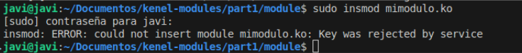
    Esta salida es esperada para un módulo no firmado en un sistema con SecureBoot activo. A continuacion se procedio a desactivarlo temporalmente:
        *   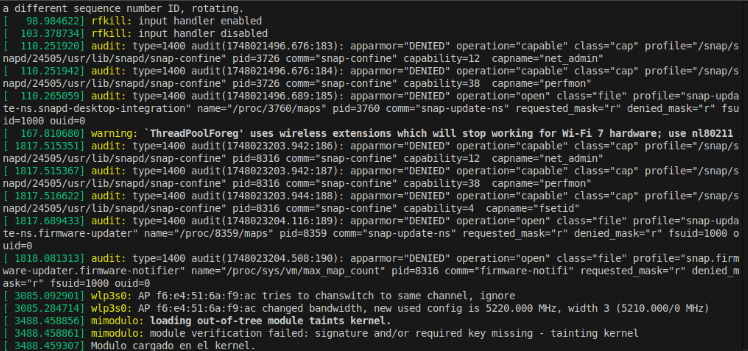
    El "taint" indica que se ha cargado código no estándar.


### Creación y Prueba del Módulo Personalizado (`hostname_module`)

Para cumplir con el requisito de crear un módulo propio que imprima el nombre del equipo, se modificó el módulo base.

**Ubicación:** `practico/05_mimodule_hostname_module/` (o el nombre que hayas usado, ej., `practico/05_hostname_module/`)

**Código Fuente (`hostname_module.c`):**
```c
#include <linux/module.h>   /* Requerido por todos los módulos */
#include <linux/kernel.h>   /* Definición de KERN_INFO */
#include <linux/utsname.h>  /* Para init_utsname() */

MODULE_LICENSE("GPL");
MODULE_DESCRIPTION("Modulo que imprime el hostname - TP4 SdeC"); 
MODULE_AUTHOR("Grupo1"); 

/* Función que se invoca cuando se carga el módulo en el kernel */
static int hostname_module_init(void) // Nombre de función opcionalmente cambiado
{
    printk(KERN_INFO "Hola desde el modulo del Grupo1! El hostname es: %s\n", init_utsname()->nodename); // CAMBIA "Javi"
    printk(KERN_INFO "Modulo personalizado hostname_module cargado en el kernel.\n");
    return 0;
}

/* Función que se invoca cuando se descarga el módulo del kernel */
static void hostname_module_exit(void) // Nombre de función opcionalmente cambiado
{
    printk(KERN_INFO "Modulo personalizado hostname_module descargado del kernel.\n");
}

/* Declaración de funciones init y exit */
module_init(hostname_module_init);
module_exit(hostname_module_exit);
```

**Makefile (en la misma carpeta):**
```makefile
obj-m +=  hostname_module.o

all:
	make -C /lib/modules/$(shell uname -r)/build M=$(PWD) modules

clean:
	make -C /lib/modules/$(shell uname -r)/build M=$(PWD) clean
```

**Pasos de Compilación y Prueba Inicial (antes de la firma):**
   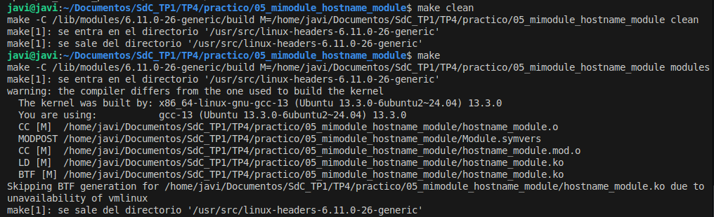

*Al igual que como se demostro previamente que ocurria, en un sistema con Secure Boot activo y que requiere firmas, el intento de carga del módulo no firmado `hostname_module.ko` resultó en:*
```
sudo insmod hostname_module.ko
insmod: ERROR: could not insert module hostname_module.ko: Key was rejected by service
```


### Firma del Módulo Personalizado `hostname_module.ko`

Se procedió a firmar el módulo `hostname_module.ko` para permitir su carga en un sistema con Secure Boot habilitado.

**Ubicación del proceso de firma:** `practico/04_kernel_signing/`

1.  **Generación de Claves MOK (Machine Owner Key):**

    ```bash
    openssl req -new -x509 -newkey rsa:2048 -keyout MOK.priv -outform DER -out MOK.der -nodes -days 36500 -subj "/CN=javi-TP4-KernelKey/"

    ```
    Captura: 
        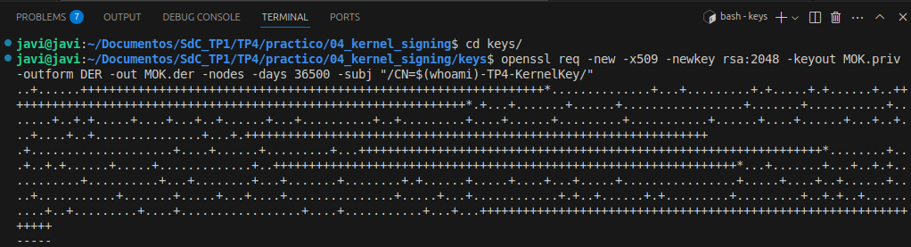

2.  **Firma del Módulo:**

    Inicialmente se copió `hostname_module.ko` a `practico/04_kernel_signing/module_to_sign`.

    Posteriormente se procedio con la realizacion de la firma (desde `practico/04_kernel_signing/`):
    ```bash
    sudo /usr/src/linux-headers-$(uname -r)/scripts/sign-file sha256 ./keys/MOK.priv ./keys/MOK.der ./module_to_sign/hostname_module.ko
    ```
    Verificación de la firma:
    ```bash
    modinfo ./module_to_sign/hostname_module.ko 
    ```
    Captura:
        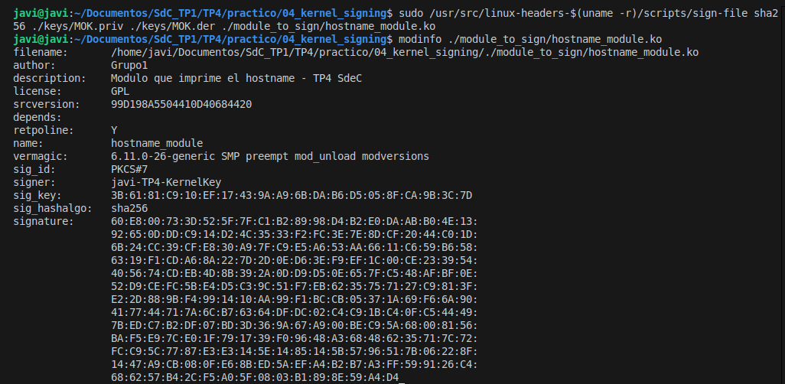

   

3.  **Inscripción de la Clave Pública MOK:**
    Comando:
    ```bash
    sudo mokutil --import ./keys/MOK.der
    ```
    Tras ingresar una contraseña temporal, se reinició el sistema. Durante el arranque, se accedió a la utilidad de MOK Management (Shim UEFI), se seleccionó "Enroll MOK", se confirmó la clave y se ingresó la contraseña establecida. Finalmente, se reinició de nuevo.

    Captura:
        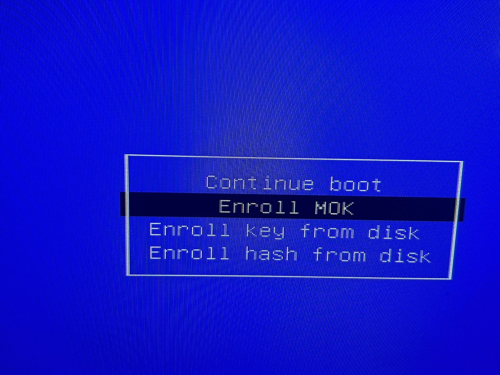
        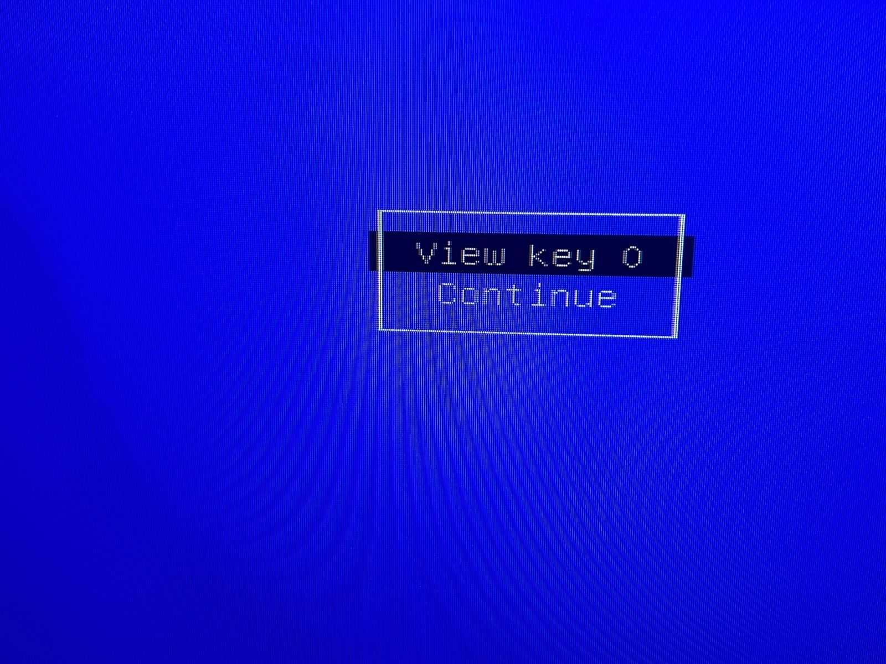
        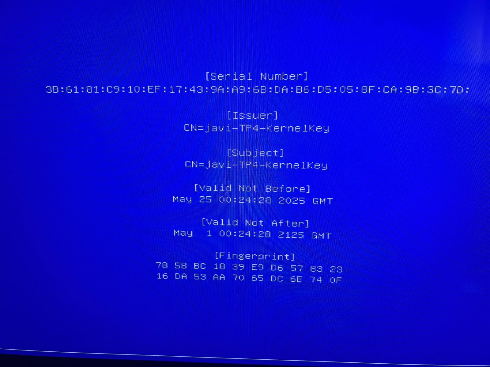

4.  **Carga y Prueba del Módulo Firmado:**
    Desde `practico/04_kernel_signing/module_to_sign/`:
    ```bash
    sudo insmod hostname_module.ko
    ```
    Luego de ello, se procedio con `sudo dmesg | tail -n 15`:

    EL módulo fue cargado correctamente, imprimió el hostname (`javi`), y el error "Key was rejected by service" no apareció, indicando que la firma y la inscripción de la MOK fueron exitosas. El "taint" por ser "out-of-tree" es esperado.

    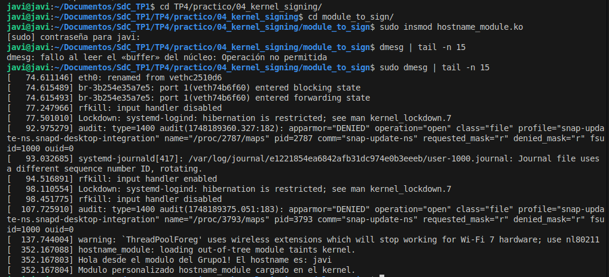

5.  **Descarga del Módulo Firmado:**
    
    Luego de ello se procedio con la descarga del modulo.
    
    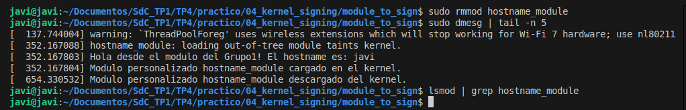

### `modinfo`: Comparación

Comparando `modinfo` para nuestro `hostname_module.ko` firmado y un módulo del sistema (`/lib/modules/$(uname -r)/kernel/crypto/des_generic.ko`):

**`modinfo hostname_module.ko`:**
    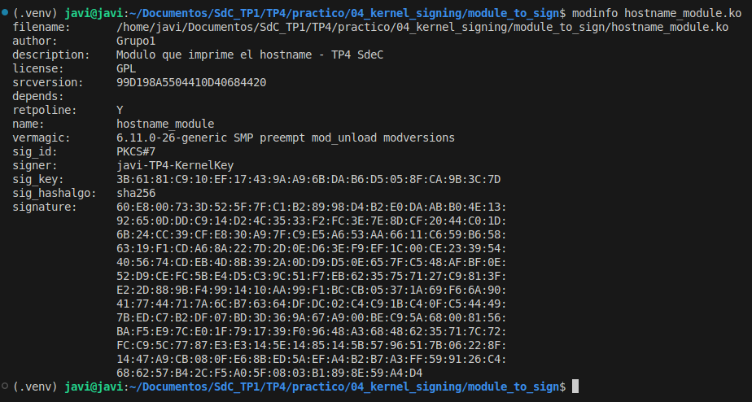

**`modinfo /lib/modules/6.11.0-26-generic/kernel/crypto/des_generic.ko.zst`:**
    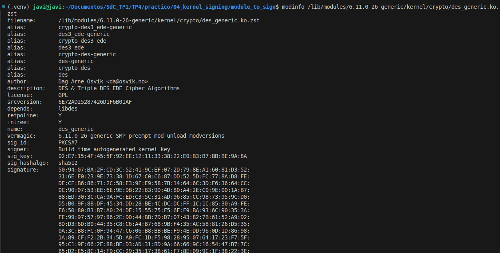

**Diferencias Observadas:**
*   **`filename`**: Rutas diferentes, uno es local y el otro del sistema.
*   **`author`, `description`**: Personalizados para nuestro módulo, genéricos o específicos de la función para el del sistema.
*   **`signer`, `sig_key`, `sig_hashalgo`**: Nuestro módulo está firmado con nuestra clave MOK personal (`Javi-TP4-KernelKey`) usando `sha256`. El módulo del sistema está firmado por "Build time autogenereted kernel key" usando un algoritmo más robusto como `sha512` y un `sig_id` de `PKCS#7`.
*   **`depends`**: Nuestro módulo simple no tiene dependencias explícitas. Módulos del sistema pueden tenerlas.
*   **`alias`**: Los módulos del sistema suelen tener alias para ser cargados automáticamente por el kernel cuando se detecta cierto hardware o se necesita una funcionalidad.

### Módulos Cargados vs. Disponibles

**Módulos cargados actualmente:**
La salida de `lsmod` muestra los módulos activos en el sistema. Se adjuntan las salidas de los integrantes y su `diff`:
*   `practico/02_system_info/lsmod_javi.txt`
*   `practico/02_system_info/lsmod_gabriel.txt`
*   `practico/02_system_info/lsmod_diff.txt`
*   `practico/02_system_info/lsmod_facundo.txt`

Las diferencias entre las salidas de `lsmod` de distintos integrantes se deben principalmente a:
*   **Hardware diferente:** Cada PC tiene componentes distintos (tarjeta gráfica, de red, sonido, etc.), lo que resulta en la carga de drivers (módulos) específicos para ese hardware.
*   **Software y servicios en ejecución:** Diferentes aplicaciones o servicios pueden requerir la carga de ciertos módulos (ej., módulos para Docker, virtualización, sistemas de archivos específicos).
*   **Configuración del kernel:** Aunque la base del kernel sea la misma (Ubuntu), pequeñas diferencias en la configuración o actualizaciones pueden influir.

**Módulos disponibles pero no cargados:**
El directorio `/lib/modules/$(uname -r)/kernel/` contiene una vasta cantidad de módulos (`.ko` o `.ko.zst`) disponibles que el kernel puede cargar bajo demanda. Por ejemplo, el driver para disqueteras (`floppy.ko.zst`) suele estar disponible pero no cargado en sistemas modernos sin este hardware.
Se generó un archivo de ejemplo con algunos módulos disponibles: `practico/02_system_info/available_modules_sample.txt`.

**¿Qué pasa cuando el driver de un dispositivo no está disponible?**
Si el driver para un dispositivo de hardware específico no está disponible en el sistema (ni compilado en el kernel monolíticamente, ni como módulo cargable):
1.  **El dispositivo no será reconocido:** El sistema operativo no sabrá cómo interactuar con el hardware.
2.  **Funcionalidad nula o limitada:** El dispositivo no funcionará en absoluto, o podría operar en un modo muy básico si existe algún driver genérico compatible (ej., una tarjeta gráfica funcionando con VESA genérico en baja resolución).
3.  **Mensajes de error:** `dmesg` o logs del sistema podrían indicar que se detectó hardware desconocido o que no se pudo encontrar un driver adecuado.
Para solucionarlo, se necesitaría compilar e instalar el módulo correspondiente o, si es parte del kernel, asegurarse de que la funcionalidad esté habilitada.

### `hwinfo`

Se ejecutó `hwinfo --all --log hwinfo_report_javi.txt` en una PC real. El reporte se encuentra en:
`practico/02_system_info/hwinfo_report_javi.txt`

### Diferencia entre Módulo y Programa

| Característica         | Programa (Espacio de Usuario)                      | Módulo de Kernel (Espacio de Kernel)             |
|------------------------|----------------------------------------------------|---------------------------------------------------|
| **Entorno Ejecución**  | Espacio de usuario, aislado del kernel y otros procesos. | Espacio de kernel, con privilegios máximos.       |
| **Memoria**            | Propio espacio de direcciones virtuales.             | Comparte el espacio de direcciones del kernel.    |
| **API Disponible**     | Bibliotecas estándar (libc: `printf`, `malloc`), llamadas al sistema. | API del kernel (`printk`, `kmalloc`), funciones exportadas por el kernel y otros módulos. No usa libc. |
| **Privilegios**        | Limitados. Acceso a hardware mediado por el kernel. | Acceso directo al hardware y a toda la memoria. |
| **Manejo de Errores**  | Un error (ej. segfault) afecta solo al programa. El kernel lo termina. | Un error grave (ej. segfault) puede causar un kernel panic y colgar el sistema. |
| **Carga/Enlace**       | Cargado por el SO cuando se ejecuta. Enlazado dinámicamente con bibliotecas. | Cargado/descargado dinámicamente en el kernel en ejecución (`insmod`/`rmmod`). |
| **Comunicación**       | Con el kernel vía syscalls. Con otros procesos vía IPC. | Directamente con el kernel. Puede interactuar con espacio de usuario vía `/dev`, `/proc`, syscalls extendidas. |
| **Función Principal**  | Realizar tareas para el usuario.                   | Extender la funcionalidad del kernel (drivers, fs, net). |

### Llamadas al Sistema de un "Hello World" con `strace`

Se utilizó `strace` para observar las llamadas al sistema de un simple programa "Hello World".
**Código (`practico/03_strace_hello/helloworld_strace.c`):**
```c
#include <stdio.h>

int main(void) {
    printf("Hello, strace world!\n");
    return 0;
}
```
Compilación: `gcc -o helloworld_strace helloworld_strace.c`
Ejecución con `strace`: `strace ./helloworld_strace`

La salida (`practico/03_strace_hello/strace_output.txt`) muestra varias llamadas, entre las más relevantes:
*   `execve()`: Para ejecutar el programa.
*   `brk()`, `mmap()`: Para gestión de memoria (heap, mapeo de bibliotecas).
*   `openat()`, `access()`: Para abrir y verificar archivos de bibliotecas (ej. libc.so.6, ld.so.cache).
*   `fstat()`: Para obtener información de archivos.
*   `write(1, "Hello, strace world!\n", 21)`: **Esta es la llamada al sistema clave que realiza la función `printf` para escribir la cadena en la salida estándar (descriptor de archivo 1).**
*   `exit_group(0)`: Para terminar el programa.

Evidencia visual: 
        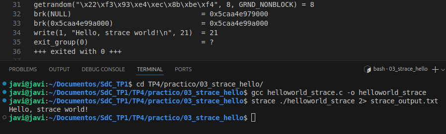

### Segmentation Fault

**¿Qué es?**
Un "segmentation fault" (falla de segmentación) o "access violation" es un error que ocurre cuando un programa intenta acceder a una dirección de memoria a la que no tiene permiso de acceso, o intenta acceder a memoria de una forma no permitida (ej., escribir en una zona de solo lectura). Las causas comunes incluyen desreferenciar un puntero nulo, acceder fuera de los límites de un array, o corrupción de memoria.

**¿Cómo lo maneja un programa (espacio de usuario)?**
1.  El hardware (MMU - Memory Management Unit) detecta el acceso inválido.
2.  El hardware genera una excepción/interrupción.
3.  El kernel maneja esta excepción.
4.  El kernel determina que el acceso inválido provino de un proceso de espacio de usuario.
5.  El kernel envía una señal al proceso infractor, típicamente `SIGSEGV` (Signal Segmentation Violation).
6.  Por defecto, si el programa no tiene un manejador específico para `SIGSEGV`, el programa termina su ejecución.
7.  Opcionalmente, el sistema puede generar un "core dump", que es una instantánea de la memoria del proceso en el momento del fallo, útil para depuración post-mortem.

**¿Cómo lo maneja el kernel (cuando ocurre en un módulo o código del kernel)?**
1.  El hardware (MMU) detecta el acceso inválido.
2.  El hardware genera una excepción/interrupción.
3.  El kernel maneja esta excepción.
4.  El kernel determina que el acceso inválido provino de su propio código (espacio de kernel).
5.  **Esto es una condición crítica y no recuperable.** No hay un "proceso" al cual enviar una señal y terminar. El kernel no puede "terminarse a sí mismo" de forma controlada y seguir funcionando.
6.  El resultado es típicamente un **Kernel Panic**.
    *   El kernel detiene toda actividad normal.
    *   Intenta volcar la máxima información de depuración posible a la consola (o a un log si está configurado), incluyendo un "stack trace" (rastreo de pila) para ayudar a identificar dónde ocurrió el fallo.
    *   El sistema se detiene (se "cuelga") o se reinicia automáticamente si está configurado para ello.
    *   Un segmentation fault en el kernel es un bug grave que debe ser corregido en el código del kernel o del módulo.

### Carga de Módulo Firmado por un Compañero con Secure Boot Habilitado

Si un compañero con Secure Boot habilitado en su PC intenta cargar un módulo que yo he firmado con mis claves MOK personales (`MOK.priv` y `MOK.der`):
*   **El módulo NO cargará.**
*   El compañero recibirá un error similar a `insmod: ERROR: could not insert module ... : Key was rejected by service` o `Required key not available`.

**Razón:**
Secure Boot, cuando está activo y el kernel lo refuerza, requiere que los módulos estén firmados por una clave cuya parte pública esté presente en una base de datos de confianza del sistema. Esta base de datos incluye:
1.  Claves embebidas en el firmware UEFI (de Microsoft, del fabricante del hardware).
2.  Claves en el llavero del kernel (kernel keyring).
3.  Claves inscritas en la lista MOK (Machine Owner Key) a través de Shim.

Mi clave MOK pública (`MOK.der`) fue inscrita en *mi* sistema. El sistema de mi compañero no conoce esta clave pública, por lo tanto, no puede verificar la firma del módulo que yo le pasé. Para que él pudiera cargar mi módulo firmado, necesitaría:
1.  Que yo le proporcione mi `MOK.der` (solo la parte pública, nunca la privada).
2.  Que él importe esa `MOK.der` en su propio MOKList usando `mokutil --import` y completando el proceso de inscripción en el arranque de su máquina.

Sin este paso, su sistema no confía en la firma realizada con mi clave.

### Artículo de Ars Technica: Parche de Microsoft sobre GRUB y Secure Boot

Referencia: `https://arstechnica.com/security/2024/08/a-patch-microsoft-spent-2-years-preparing-is-making-a-mess-for-some-linux-users/`

1.  **¿Cuál fue la consecuencia principal del parche de Microsoft sobre GRUB en sistemas con arranque dual (Linux y Windows)?**
    La consecuencia principal fue que, para algunos usuarios de Linux con arranque dual y Secure Boot habilitado, el parche de Microsoft (destinado a revocar shims de GRUB2 vulnerables conocidos como "BlackLotus") provocó que sus sistemas Linux dejaran de arrancar. Esto ocurrió porque la base de datos de revocación de Secure Boot (DBX) fue actualizada para incluir hashes de versiones vulnerables de GRUB2 que muchas distribuciones de Linux aún utilizaban o cuyos shims no estaban adecuadamente actualizados/firmados para manejar esta revocación. Al no poder verificar el cargador de arranque GRUB2 contra una firma válida no revocada, Secure Boot impedía su ejecución.

2.  **¿Qué implicancia tiene desactivar Secure Boot como solución al problema descrito en el artículo?**
    Desactivar Secure Boot como solución al problema permite que el sistema Linux vuelva a arrancar porque el firmware UEFI ya no verifica la firma del cargador de arranque GRUB2 (ni de otros componentes de la cadena de arranque). Sin embargo, la implicancia principal es una **reducción significativa de la seguridad del proceso de arranque**. Secure Boot está diseñado para proteger contra bootkits y otro malware que intenta comprometer el sistema antes de que el sistema operativo cargue completamente. Al desactivarlo, se pierde esta capa de protección, dejando el sistema más vulnerable a ataques que modifican el cargador de arranque o el kernel. Es una solución funcional, pero a costa de la seguridad.

3.  **¿Cuál es el propósito principal del Secure Boot en el proceso de arranque de un sistema?**
    El propósito principal de Secure Boot es asegurar que cada componente de software cargado durante el proceso de arranque (desde el firmware UEFI, pasando por el cargador de arranque del sistema operativo, hasta el kernel y, a veces, los drivers críticos) esté firmado digitalmente por una entidad de confianza y que la firma sea válida. Esto ayuda a prevenir la ejecución de malware (como bootkits o rootkits de arranque) que podría haberse insertado en la cadena de arranque para tomar control del sistema antes de que las defensas del sistema operativo estén activas. Secure Boot busca garantizar la integridad y autenticidad del software de arranque.

## Desafío #2 (Respuestas Detalladas)

### ¿Qué funciones tiene disponible un programa y un módulo?

**Programa (Espacio de Usuario):**
*   **Biblioteca Estándar de C (libc):** Acceso completo a funciones como `printf()`, `scanf()`, `malloc()`, `free()`, `fopen()`, `strcpy()`, `perror()`, etc. Estas funciones a su vez realizan llamadas al sistema para interactuar con el kernel.
*   **Otras Bibliotecas de Usuario:** Puede enlazar con cualquier biblioteca de espacio de usuario (ej., `libpthread` para hilos, `libcurl` para red, bibliotecas gráficas como GTK/Qt).
*   **Llamadas al Sistema (Syscalls):** Es la interfaz principal para solicitar servicios del kernel (ej., `open`, `read`, `write`, `fork`, `execve`, `socket`).

**Módulo de Kernel:**
*   **No tiene acceso a `libc` ni a otras bibliotecas de espacio de usuario.** No puede usar `printf()` directamente (usa `printk()`), ni `malloc()` estándar (usa `kmalloc()`, `vmalloc()`, etc.).
*   **API del Kernel:** Dispone de un conjunto específico de funciones exportadas por el kernel y otros módulos ya cargados. Estas funciones permiten:
    *   **Gestión de memoria del kernel:** `kmalloc()`, `kfree()`, `vmalloc()`, `__get_free_pages()`.
    *   **Registro y mensajes:** `printk()`.
    *   **Interacción con el espacio de usuario:** `copy_to_user()`, `copy_from_user()`, `get_user()`, `put_user()`.
    *   **Manejo de interrupciones:** `request_irq()`, `free_irq()`.
    *   **Temporizadores:** `init_timer()`, `add_timer()`, `mod_timer()`.
    *   **Sincronización:** Semáforos, mutexes del kernel, spinlocks (`spin_lock()`, `mutex_lock()`).
    *   **Registro de dispositivos:** `register_chrdev()`, `register_netdev()`.
    *   **Acceso a hardware:** `ioremap()`, `inb()`, `outb()`.
    *   **Funciones de bajo nivel del sistema:** Manipulación de listas, árboles, etc.
*   **Símbolos Exportados:** Un módulo puede usar funciones exportadas por el kernel (`EXPORT_SYMBOL`, `EXPORT_SYMBOL_GPL`) o por otros módulos.

### Espacio de Usuario o Espacio del Kernel

Son dos modos de operación distintos del procesador, con diferentes niveles de privilegio y acceso a recursos:

**Espacio de Kernel (Kernel Mode, Ring 0 en x86):**
*   **Máximos Privilegios:** El código que se ejecuta en este espacio tiene acceso irrestricto a todo el hardware del sistema (CPU, memoria, periféricos) y a todas las instrucciones del procesador.
*   **Acceso Directo a Hardware:** Puede manipular directamente los registros de los dispositivos, gestionar interrupciones, etc.
*   **Espacio de Direcciones Único:** Todo el código del kernel (y los módulos cargados) comparten un único espacio de direcciones virtuales. Un error en una parte del kernel puede afectar a todo el sistema.
*   **Protección:** Es responsable de protegerse a sí mismo y de proteger los recursos del sistema.
*   **Funciones:** Aquí reside el núcleo del sistema operativo, manejando la gestión de procesos, memoria, archivos, red y la interacción con el hardware a través de los drivers.
*   **Módulos de Kernel:** Se ejecutan en este espacio.

**Espacio de Usuario (User Mode, Ring 3 en x86):**
*   **Privilegios Limitados:** El código que se ejecuta aquí tiene un acceso restringido al hardware y a ciertas instrucciones del procesador.
*   **Acceso Indirecto a Hardware:** Para interactuar con el hardware o solicitar servicios del sistema, un programa de usuario debe realizar una "llamada al sistema" (syscall), que transfiere el control al kernel de forma controlada.
*   **Espacio de Direcciones Virtuales Aislado:** Cada proceso de usuario tiene su propio espacio de direcciones virtuales privado. Un proceso no puede acceder directamente a la memoria de otro proceso o del kernel (salvo mecanismos controlados como memoria compartida).
*   **Protección:** El kernel protege a los procesos entre sí y al propio kernel de los procesos de usuario. Si un programa de usuario falla (ej. segfault), solo ese programa se ve afectado (generalmente es terminado por el kernel).
*   **Funciones:** Aquí se ejecutan todas las aplicaciones del usuario (navegadores, editores de texto, juegos, etc.).

La transición entre estos espacios es un aspecto fundamental de la arquitectura de los sistemas operativos modernos, proporcionando robustez y seguridad.

### Espacio de Datos

Se refiere a cómo y dónde los programas y módulos almacenan sus variables y estructuras de datos.

**Programa (Espacio de Usuario):**
Un proceso de usuario típico tiene varias secciones de memoria para sus datos dentro de su espacio de direcciones virtual:
*   **Segmento de Texto (Código):** Contiene las instrucciones ejecutables del programa (generalmente de solo lectura).
*   **Segmento de Datos Inicializados:** Variables globales y estáticas que tienen un valor inicial asignado en el código.
*   **Segmento BSS (Block Started by Symbol):** Variables globales y estáticas no inicializadas explícitamente (el sistema las inicializa a cero).
*   **Heap (Montículo):** Memoria asignada dinámicamente durante la ejecución del programa mediante funciones como `malloc()`, `calloc()`, `realloc()`. Crece hacia direcciones más altas.
*   **Stack (Pila):** Usada para variables locales de funciones, argumentos de funciones, direcciones de retorno. Crece hacia direcciones más bajas. Cada hilo tiene su propia pila.

**Módulo de Kernel:**
*   **Variables Globales/Estáticas:** Los módulos pueden tener variables globales y estáticas. Estas residen en el espacio de direcciones del kernel y son accesibles por todo el código del módulo (y potencialmente por otro código del kernel si se exportan). Deben usarse con cuidado debido a la concurrencia en el kernel.
*   **Memoria Dinámica del Kernel:**
    *   **`kmalloc()`:** Es la forma más común de asignar pequeñas cantidades de memoria contigua físicamente en el kernel. Es rápida pero puede fallar si no hay bloques contiguos disponibles. La memoria debe liberarse con `kfree()`.
    *   **`vmalloc()`:** Asigna memoria virtualmente contigua pero que puede no serlo físicamente. Útil para grandes asignaciones donde la contigüidad física no es crítica. Se libera con `vfree()`.
    *   **Asignadores de páginas:** (`alloc_pages()`, `__get_free_pages()`) para obtener páginas completas de memoria.
*   **Pila del Kernel:** Cada proceso, cuando se encuentra ejecutando código del kernel (debido a una syscall o una interrupción), utiliza una pila de kernel. Estas pilas son de tamaño limitado (generalmente 8KB o 16KB en x86_64). Los módulos deben ser cuidadosos de no desbordar la pila del kernel, evitando grandes variables locales o recursión excesiva.
*   **No hay "heap" en el sentido del espacio de usuario.** La gestión de memoria es más directa y crítica.

### Drivers. Investigar contenido de `/dev`

**Drivers (Controladores de Dispositivo):**
Un driver es un tipo especializado de módulo de kernel (o a veces código compilado directamente en el kernel) cuyo propósito es permitir que el sistema operativo se comunique e interactúe con un dispositivo de hardware específico (ej., una tarjeta de red, un disco duro, un mouse, una impresora) o un dispositivo "virtual" (ej., `/dev/null`).

El driver actúa como un traductor entre los comandos genéricos del sistema operativo (ej., "leer datos del disco") y los comandos específicos que el hardware entiende. Abstrae los detalles del hardware, presentando una interfaz más o menos estandarizada al resto del kernel.

**Contenido de `/dev` (device files):**
El directorio `/dev` en sistemas tipo Unix no contiene datos de archivos comunes, sino **archivos especiales de dispositivo** (device nodes). Estos archivos son interfaces que permiten a los programas de espacio de usuario interactuar con los drivers de los dispositivos en el kernel. Cuando un programa realiza operaciones (como `open`, `read`, `write`, `ioctl`) sobre un archivo en `/dev`, el kernel redirige estas operaciones al driver correspondiente.

Principales tipos de archivos de dispositivo en `/dev`:
*   **Dispositivos de Bloque (Block Devices):** Representan dispositivos que almacenan datos en bloques de tamaño fijo y permiten el acceso aleatorio a estos bloques (ej., discos duros, SSDs, unidades USB).
    *   Ejemplos:
        *   `/dev/sda`, `/dev/sdb`: Discos duros o SSDs SATA/SCSI.
        *   `/dev/sda1`, `/dev/sdb1`: Particiones en esos discos.
        *   `/dev/nvme0n1`: Discos SSD NVMe.
        *   `/dev/nvme0n1p1`: Particiones en discos NVMe.
        *   `/dev/loop0`, `/dev/loop1`: Dispositivos loopback, usados para montar imágenes de disco como si fueran dispositivos físicos.
*   **Dispositivos de Carácter (Character Devices):** Representan dispositivos que transmiten datos carácter por carácter (o en flujos de bytes) y generalmente no soportan acceso aleatorio o buffering a nivel de dispositivo.
    *   Ejemplos:
        *   `/dev/ttyS0`, `/dev/ttyS1`: Puertos serie.
        *   `/dev/tty1` a `/dev/tty63`: Terminales virtuales (consolas de texto).
        *   `/dev/ptmx`: Multiplexor de pseudo-terminales (para crear pares master/slave).
        *   `/dev/pts/0`, `/dev/pts/1`: Pseudo-terminales esclavas (las que usan las terminales gráficas como `gnome-terminal`).
        *   `/dev/null`: El "agujero negro", cualquier cosa escrita aquí se descarta, leerlo devuelve EOF.
        *   `/dev/zero`: Proporciona un flujo infinito de bytes cero al ser leído.
        *   `/dev/random`, `/dev/urandom`: Fuentes de números aleatorios.
        *   `/dev/console`: La consola física del sistema.
        *   `/dev/input/mice`, `/dev/input/eventX`: Dispositivos de entrada (mouse, teclado).
        *   `/dev/snd/pcmC0D0p`: Dispositivos de audio PCM (para reproducción/grabación).
        *   `/dev/fb0`: Framebuffer, acceso directo a la memoria de video.
        *   `/dev/kvm`: Interfaz para el módulo de virtualización KVM.
*   **Otros:** También pueden existir enlaces simbólicos y directorios.

Cada archivo de dispositivo está asociado con un número **mayor** (que identifica al driver) y un número **menor** (que el driver usa para distinguir entre múltiples dispositivos que controla, si es el caso). Se pueden ver con `ls -l /dev`.

## Bibliografía

*   Linux Kernel Module Programming Guide (LKMPG): `https://sysprog21.github.io/lkmpg/`
*   Red Hat Enterprise Linux 8 Documentation - Signing kernel modules for Secure Boot: `https://access.redhat.com/documentation/es-es/red_hat_enterprise_linux/8/html/managing_monitoring_and_updating_the_kernel/signing-kernel-modules-for-secure-boot_managing-kernel-modules`
*   strace(1) - Linux manual page: `https://man7.org/linux/man-pages/man1/strace.1.html` (o `man strace`)
*   checkinstall documentation (generalmente `man checkinstall` o recursos online).
*   Artículo de Ars Technica: "A patch Microsoft spent 2 years preparing is making a mess for some Linux users": `https://arstechnica.com/security/2024/08/a-patch-microsoft-spent-2-years-preparing-is-making-a-mess-for-some-linux-users/`
