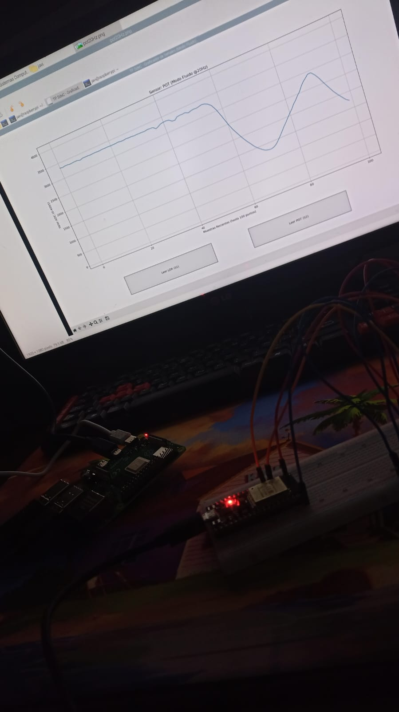
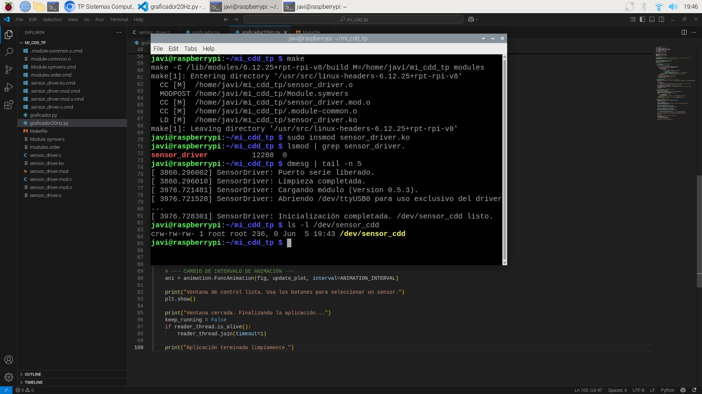
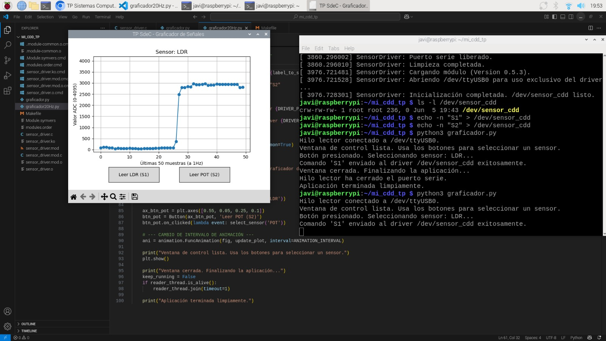
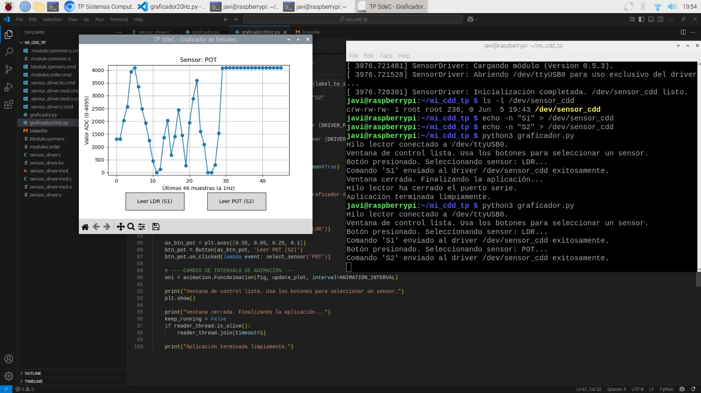
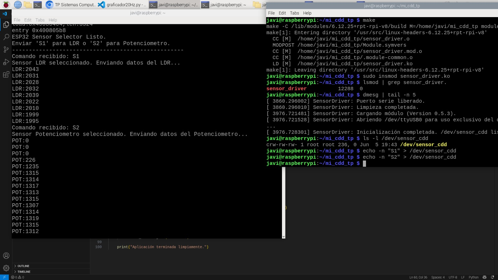
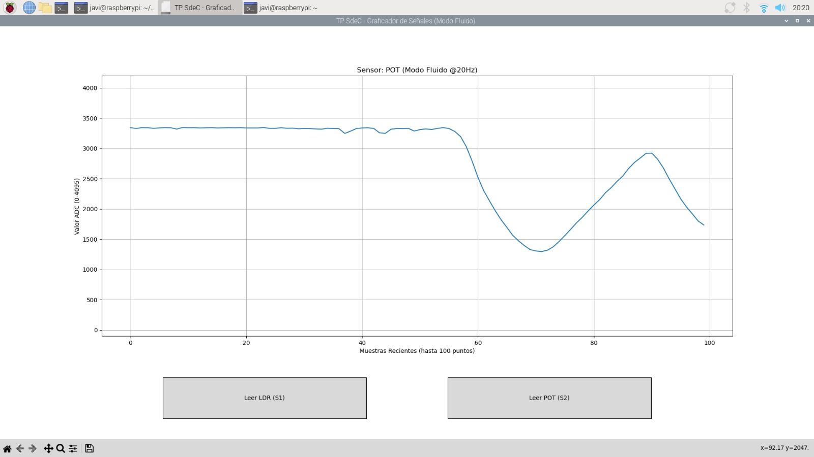

# Trabajo Práctico N°5: Driver de Caracteres y Graficador de Sensores

 
**Materia:** Sistemas de Computación  
**Integrantes:**
*   Bustos Hugo Gabriel
*   Rodriguez Facundo
*   Vasquez Francisco Javier  

**Grupo:** Grupo1  
**Fecha de Entrega:** 06/06/2025  
**Profesores:** Miguel Ángel Solinas, Javier Alejandro Jorge  

## Introducción

El presente trabajo práctico tiene como objetivo el diseño e implementación de un sistema completo que abarca desde la programación a bajo nivel en el kernel de Linux hasta el desarrollo de una aplicación de usuario con interfaz gráfica. El núcleo del proyecto es la creación de un **Driver de Caracteres (Character Device Driver - CDD)** que actúa como intermediario para controlar un dispositivo externo.

Se ha construido un sistema donde una placa de desarrollo **ESP32** se encarga de realizar mediciones de dos sensores analógicos (un LDR y un potenciómetro). Un driver de kernel en una **Raspberry Pi** gestiona la comunicación con la ESP32, permitiendo seleccionar qué sensor leer. Finalmente, una aplicación de usuario desarrollada en Python lee los datos del sensor seleccionado y los grafica en tiempo real utilizando la librería Matplotlib.

Este proyecto integra conocimientos de sistemas embebidos, programación de módulos de kernel en C, y desarrollo de aplicaciones de escritorio en Python, demostrando el flujo completo de control y datos entre el hardware, el kernel y el espacio de usuario.

 

## Componentes Utilizados

*   **Hardware:**
    *   Raspberry Pi 4 Model B
    *   Placa de desarrollo ESP32
    *   Sensor de luz (LDR) con resistencia pull-down
    *   Potenciómetro
    *   Protoboard y cables de conexión

*   **Software y Herramientas:**
    *   Raspberry Pi OS (64-bit)
    *   Headers del kernel de Linux y `build-essential` para la compilación de módulos.
    *   Arduino IDE para la programación del firmware del ESP32.
    *   Python 3 con las librerías `matplotlib`, `pyserial`.

## Arquitectura del Sistema

El sistema se divide en tres componentes principales que interactúan de la siguiente manera:

1.  **Controlador de Dispositivo (ESP32):** Actúa como un sistema de adquisición de datos.
    *   Lee los valores analógicos de un LDR y un Potenciómetro.
    *   Espera comandos ("S1" o "S2") a través del puerto serie para seleccionar el sensor activo.
    *   Envía periódicamente los datos del sensor seleccionado en un formato de texto simple (`ETIQUETA:VALOR`) a través de su puerto serie USB.

2.  **Driver de Caracteres (`sensor_cdd`):** Es el corazón del proyecto a nivel de sistema operativo.
    *   Se carga como un módulo de kernel (`.ko`) en la Raspberry Pi.
    *   Al iniciarse, abre de forma exclusiva el puerto serie `/dev/ttyUSB0`, impidiendo que otros procesos interfieran.
    *   Crea un nuevo dispositivo de caracteres en `/dev/sensor_cdd`.
    *   Su única función es la de **control**: reenvía cualquier dato escrito en `/dev/sensor_cdd` directamente al ESP32. Esto permite que la aplicación de usuario controle el sensor sin acceder directamente al hardware de comunicación.

3.  **Aplicación de Usuario (`graficador.py`):** Proporciona la interfaz gráfica y la visualización.
    *   **Control:** Cuando el usuario presiona un botón ("Leer LDR" o "Leer POT"), la aplicación escribe el comando correspondiente ("S1" o "S2") en el archivo de dispositivo del driver (`/dev/sensor_cdd`).
    *   **Lectura de Datos:** Un hilo dedicado en la aplicación lee continuamente el flujo de datos directamente desde `/dev/ttyUSB0`.
    *   **Visualización:** Utiliza `matplotlib` para actualizar un gráfico en tiempo real, mostrando únicamente los datos del sensor actualmente seleccionado. El gráfico se resetea al cambiar de sensor.

Esta arquitectura separa claramente las responsabilidades: el ESP32 gestiona el hardware, el driver gestiona el control y el acceso exclusivo, y la aplicación gestiona la interacción con el usuario y la presentación de datos.


## Guía de Instalación y Uso

### Paso 1: Montaje del Hardware y Carga del Firmware

1.  **Montaje Físico:** Conectar el LDR y el potenciómetro a los pines ADC de la ESP32 (GPIO35 y GPIO34 respectivamente), y la ESP32 a la Raspberry Pi mediante un cable USB.
2.  **Firmware:** Abrir `esp32/esp32_firmware_1hz.ino` con el Arduino IDE, seleccionar la placa ESP32 y el puerto correcto, y cargar el código. Para una mayor frecuencia de muestreo, se puede utilizar `esp32_firmware_fluido.ino`.

### Paso 2: Compilar y Cargar el Driver en Raspberry Pi

1.  **Instalar dependencias:** Asegurarse de tener los headers del kernel y las herramientas de compilación.
    ```bash
    sudo apt update
    sudo apt install raspberrypi-kernel-headers build-essential
    ```
2.  **Navegar a la carpeta del driver:**
    ```bash
    cd TP5/driver
    ```
3.  **Compilar el módulo:**
    ```bash
    make
    ```
4.  **Cargar el módulo en el kernel:**
    ```bash
    sudo insmod sensor_driver.ko
    ```
5.  **Verificar la carga:** Se puede comprobar que el driver se ha cargado y el dispositivo se ha creado correctamente con los siguientes comandos. La salida debería ser similar a la mostrada en la captura.
    ```bash
    lsmod | grep sensor_driver
    dmesg | tail
    ls -l /dev/sensor_cdd
    ```
    

### Paso 3: Ejecutar la Aplicación de Usuario

1.  **Navegar a la carpeta de la aplicación:**
    ```bash
    cd ../userspace
    ```
2.  **Crear un entorno virtual e instalar dependencias:**
    ```bash
    # Crear el archivo requirements.txt con "pyserial" y "matplotlib"
    python3 -m venv venv
    source venv/bin/activate
    pip install -r requirements.txt
    ```
3.  **Ejecutar el graficador:**
    ```bash
    python3 graficador.py
    ```

## Demostración y Resultados

Al ejecutar la aplicación, se presenta una ventana con dos botones. Al hacer clic en ellos, se envía el comando correspondiente al driver, y el gráfico comienza a mostrar en tiempo real los datos del sensor seleccionado, cumpliendo con los requisitos del enunciado.

**Funcionamiento Básico (1Hz):**





**Demostración del Sistema Integrado:**
La siguiente imagen muestra una etapa intermedia del proceso de desarrollo en la cual desde una terminal se hacia uso del driver implementado, y de la otra se escuchaba el puerto USB0 con minicom.



**Modo Fluido (20Hz):**
Como mejora adicional, se implementó una versión del sistema que opera a 20Hz para una visualización más suave y reactiva.



Se ha grabado también un breve **video demostrativo** del sistema en funcionamiento, el cual se encuentra en `img/video_demostracion.mp4`.

## Código Fuente Destacado

#### Driver (`driver/sensor_driver.c`)
La función `my_write` es el núcleo del control. Recibe los datos del espacio de usuario y los escribe directamente en el `filp` del puerto serie que se abrió al cargar el módulo. La función devuelve `user_len` en lugar de `written_count` para asegurar la compatibilidad con la llamada `write` del espacio de usuario.

```c
static ssize_t my_write(struct file *filp_cdd, const char __user *user_buf, size_t user_len, loff_t *off) {
    char *kernel_buf;
    ssize_t written_count;
    loff_t offset = 0;

    if (unlikely(!serial_port_filp)) {
        printk(KERN_ALERT "SensorDriver: my_write: el filp del puerto serie es NULO.\n");
        return -EIO;
    }

    // +1 para el terminador '\n' que espera el ESP32
    kernel_buf = kmalloc(user_len + 1, GFP_KERNEL);
    if (!kernel_buf) return -ENOMEM;

    if (copy_from_user(kernel_buf, user_buf, user_len)) {
        kfree(kernel_buf);
        return -EFAULT;
    }
    kernel_buf[user_len] = '\n';
    
    // Escribimos en el archivo del puerto serie
    written_count = kernel_write(serial_port_filp, kernel_buf, user_len + 1, &offset);
    
    kfree(kernel_buf);

    if (written_count < 0) return written_count;
    
    // Devolvemos la cantidad de bytes que el USUARIO pidió escribir.
    return user_len;
}
```

#### Aplicación de Usuario (`userspace/graficador.py`)
La función `select_sensor` es llamada por los botones de la GUI. Actualiza la variable global que indica qué sensor graficar y escribe el comando apropiado en el archivo de dispositivo del driver.


---

### **Parte 3: Código de la Aplicación**


```python
def select_sensor(label_to_select):
    global current_sensor_label
    print(f"Botón presionado. Seleccionando sensor: {label_to_select}...")
    current_sensor_label = label_to_select
    
    command = "S1" if label_to_select == "LDR" else "S2"
    try:
        # Abre, escribe y cierra el archivo del driver.
        with open(DRIVER_PATH, 'w') as f:
            f.write(command)
        print(f"Comando '{command}' enviado al driver {DRIVER_PATH} exitosamente.")
    except IOError as e:
        print(f"ERROR: No se pudo escribir en el driver {DRIVER_PATH}: {e}")
```

## Análisis y Decisiones de Diseño

*   **Separación de Control y Datos:** Una decisión de diseño clave fue cómo manejar el flujo de datos desde el ESP32. Una arquitectura "canónica" podría implicar implementar una función `read()` en el driver. Sin embargo, esto añade una complejidad significativa (gestión de buffers, colas de espera, sincronización) que no era el foco principal del TP. En su lugar, se adoptó una arquitectura más pragmática:
    *   El **driver** se especializa en **control** y en garantizar el **acceso exclusivo** al puerto serie.
    *   La **aplicación de usuario** se encarga de leer el flujo de datos, lo cual es una tarea que las librerías de espacio de usuario como `pyserial` resuelven de manera muy eficiente.
    Esta separación mantiene el código del kernel simple y robusto, delegando la lógica de parsing y visualización al espacio de usuario, donde es más fácil de desarrollar y depurar.

*   **Robustez del Driver:** El driver abre el puerto serie (`/dev/ttyUSB0`) al ser cargado (`insmod`) y lo mantiene abierto hasta que es descargado (`rmmod`). Esto asegura que, mientras el driver esté activo, ningún otro proceso pueda interferir con la comunicación con el ESP32, evitando conflictos.

*   **Mejora de Fluidez:** Se desarrollaron versiones alternativas del firmware y la aplicación para operar a 20Hz. Esto no era un requisito del TP, pero sirve para demostrar la flexibilidad y capacidad del sistema para manejar tasas de datos más altas, resultando en una experiencia de usuario final mucho más fluida y profesional.

## Bibliografía

*   Linux Kernel Module Programming Guide (LKMPG): `https://sysprog21.github.io/lkmpg/`
*   Documentación de Matplotlib: `https://matplotlib.org/stable/contents.html`
*   Documentación de PySerial: `https://pyserial.readthedocs.io/en/latest/`
*   The Linux Kernel documentation: `https://www.kernel.org/doc/html/latest/`


